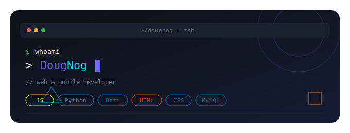

<!-- ============================================================ -->
<!--  DougNog • README único                                       -->
<!--  Todos os SVGs deste README foram desenhados à mão —          -->
<!--  nada foi gerado por serviços tipo shields.io genéricos.      -->
<!-- ============================================================ -->

<div align="center">
  
</div>

<br/>

<div align="center">
  
  
  
</div>

---

## ╭─ Character sheet

<div align="center">
  
</div>

---

## ╭─ Terminal ao vivo

<div align="center">
  
</div>

---

## ╭─ Skills

<div align="center">
  
</div>

---

## ╭─ Jornada de aprendizado

> 🌱 **Ainda não tenho projetos públicos pra mostrar — e tá tudo bem.**
> Estou na fase de construir uma base sólida. Cada commit aqui é uma página da minha jornada. Volta aqui em breve que vai ter coisa nova. 🚀

<div align="center">

```
┌─────────────────────────────────────────────┐
│                                             │
│   📚  Em aprendizado agora                  │
│   ───────────────────────                   │
│   →  Aprofundando JavaScript moderno        │
│   →  Explorando Flutter com Dart            │
│   →  Construindo backends com Python        │
│   →  Modelando dados com MySQL              │
│                                             │
│   🎯  Próximo boss                          │
│   ───────────────────────                   │
│   →  Primeiro projeto full-stack público    │
│                                             │
└─────────────────────────────────────────────┘
```

</div>

---

## ╭─ GitHub em números

<div align="center">
  
  
</div>

<div align="center">
  
</div>

---

## ╭─ Snake devorando os commits

<div align="center">
  
</div>

---

## ╭─ Contato

<div align="center">
  <a href="mailto:SEU_EMAIL@gmail.com"></a>
  <a href="https://linkedin.com/in/SEU_LINKEDIN"></a>
  <a href="https://instagram.com/SEU_INSTA"></a>
</div>

<br/>

<div align="center">
  <sub>✦ crafted by <b>DougNog</b> • never stop learning ✦</sub>
</div>
