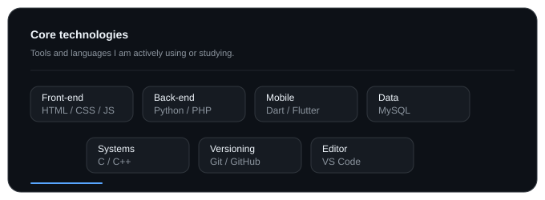
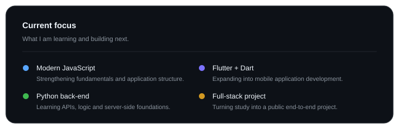

  

 

## About

I'm **Douglas Nogueira**, a developer in progress focused on building a strong foundation across **web, mobile, back-end and data**.

I use this profile to document what I'm learning, turn study into practical projects, and gradually build a public portfolio with clean, maintainable work.

  

 

  

 

  

 

## GitHub activity

  
  

  

 

## Connect

  

 

  Learning deliberately. Building consistently.

